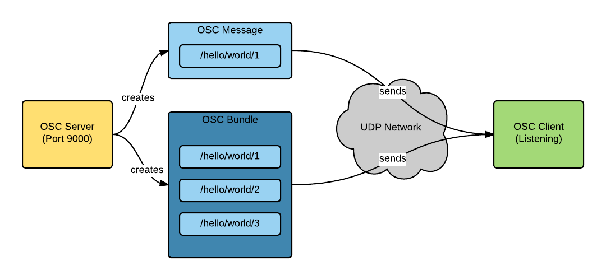
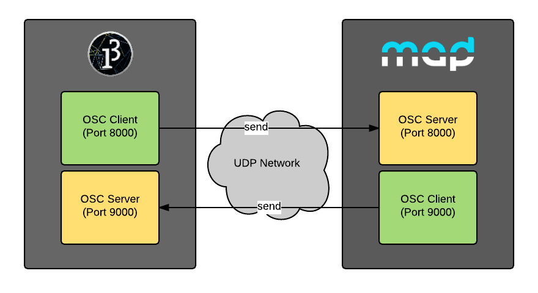

# MadMapper OSC API
This is a documentation and example respsitory for the [MadMapper][1] OSC API which was released with the [version **2.2**][19] in December 2015.

The goal of this repository is to gather examples and documentations for the api to give other developers a quick start and and overview over the api.

## Quickstart
At the moment the API does just provide to read controls (e.g. Surfaces) from MadMapper and their values.

To simply start communicating with MadMapper you have to

1. install an OSC library
2. create a new OSC client and server
3. communicate with MadMapper

## Introduction
The MadMapper OSC API uses OSC to send and receive messages. So it is useful to understand OSC and it's possibilities.

### OSC
[OSC][4] is a simple [UDP][6] based network protocol between a server and multiple clients. UDP gives you the ability to just send data and don't care about, if the client is listening or not or how many client's are listening to your message. 

The benefit of this is that it is really fast and simple. The drawback of this is that if you want to create a bidirectional channel between your software and and antoher, you have to open a server and a client on each side.

Over OSC you can send **messages** which contain a specific **address**. This address will be recognized by a client and will cause it to do something. As an addition it is also possible to send data within the message to for examples update a parameter.


*Simplified OSC Architecture*

#### OSC Bundles
To put multiple messages together it is also possible to create so called **bundles**. These contain a list of OSC messages which then will be sent over the network.
So a client is able to get messages which are related to each other as a bundle.

#### OSC Libraries
To use OSC it is recommended to use a library which covers the basic OSC methods. Here are listet the one's that are used in the examples.

##### Processing (Java)
* [oscp5][12]
	* [Documentation][13]
	* License: Copyright 2004-2015 Andreas Schlegel
	* It's recommended to use the **latest release** of the library from github!

##### .NET (C#)
* [VVVV OSC Library][9]
	* [Documentation][10]
	* License: [GPLv2][11]

## API Documentation

### Overview
Because the API is built on top of the OSC interface MadMapper creates two OSC channels. One is just for sending data from the client to MadMapper and the other one is for the opposite direction.

For example if processing should talk with MadMapper you have to create a new OSC client which maps to the input port of MadMapper and a new OSC server which listenes on the feedback port of MadMapper. The input and feedback port can be changed in the MadMapper preferences.


*MadMapper OSC API Architecture*

Now the communication is very simple, you just have to send MadMapper message from your client, and MadMapper will return you a bundle of messages on the other channel. So it is possible to have a bidirectional communication.

The drawback of this is that you don't have any information about, what **response** matches to which **request**. This could be solved by using an sequence number like in TCP.

### Method getControls
Use the Method `getControls` to receive the available controls from MadMapper.

```
/getControls?root=ROOT_URL&recursive=RECURSIVE
```

#### Parameters 
* `ROOT_URL` (*String*): The node from where to search for other controls.
* `RECURSIVE` (*Boolean*): Defines if MadMapper should send only the direct children of the `ROOT_URL` control, or if it should send back all controls below this control. Value: **0 or 1**

#### Response
MadMapper replies with a bundle which contains a message for each child of the requested node on the address of the node.

#### Example
If there is one surface in MadMapper called "Quad 1" and you send a message to following address,

```
/getControls?root=/surfaces&recursive=0
```

MadMapper sends back a bundle with two messages without data on this addresses.

```
/surfaces/selected
/surfaces/Quad 1
```

### Method getControlValues
Use `getControlValues` to receive the values of the controls from MadMapper.

```
/getControlValues?url=URL_PATTERN&normalized=NORMALIZED
```

#### Parameters
* `URL_PATTERN` (*String*): The url pattern of the Controls we are looking for, as a regular expression. A simple example is just the URL of a control `/surfaces/Quad 1/opacity`, but we might ask all controls of a surface using `/surfaces/Quad 1/.*` 
* `NORMALIZED` (*Boolean*): Defines if you want to receive the normalised value (FLOAT 0.0-1.0) or the value as it is (FLOAT, INT, BOOL, STRING, RGBA). *Remark*: RGBA and STRING values cannot be normalised, so MadMapper won’t send a reply for such addresses if normalised value is requested. Value: **0 or 1**

#### Response
MadMapper responds with a bundle that contains a message for each control that matches the URL_PATTERN, the address of the message is the address of the control and the value of the message is the current value of this control.

#### Example
If there is one surface in MadMapper called "Quad 1" and you send a message to following address,

```
/getValues?url=/surfaces/Quad 1/handles/.*&normalized=1
```

MadMapper responds with a bundle that contains eight messages with one **float** value.

```
/surfaces/Quad 1/handles/0/x 0.5 
/surfaces/Quad 1/handles/0/y 0.5 
/surfaces/Quad 1/handles/1/x 0.5 
/surfaces/Quad 1/handles/1/y 0.5 
/surfaces/Quad 1/handles/2/x 0.5 
/surfaces/Quad 1/handles/2/y 0.5 
/surfaces/Quad 1/handles/3/x 0.5 
/surfaces/Quad 1/handles/3/y 0.5
```

#### Coordinate System

## Examples
All the basic exampels are written in [processing][5] to show the general idea behind it. They should be easaly be portable to other languages and just give an idea how the API works.

For all examples we used a default MadMapper with one add surface called **Quad 1**.

### Setup OSC
First of all you have to install the OSC library for processing. For the examples we use [oscp5][12] which is developed by Andreas Schlegel. We recommend to use the latest version from github and not the one from processing library.

Now we need to import the namespaces for the OSC and network classes and create two new variables to store the client and the server.

```java
import oscP5.*;
import netP5.*;

// OSC server and client
OscP5 osc;
NetAddress madMapper;
```

In the setup method we now have to initialize both so we can use them later. The `osc` varibale is our server which receives the messages from MadMapper. `madMapper` is the remote host to where we will send messages.

```java
void setup()
{
  //init osc with default ports
  osc = new OscP5(this, 9000);
  madMapper = new NetAddress("127.0.0.1", 8000);
}
```

To receive data from MadMapper we have to create two methods which will be mapped used from the `OscP5`. One is to receive OSC messages and the other one to receive OSC bundles. And to make the sketch complete you should add a `draw` method.

```java
void draw() {}
void oscEvent(OscBundle bundle) {}
void oscEvent(OscMessage msg) {}
```

[Full Source Code][15]

### Receive surfaces
After setting up the OSC client we now would like to know which surfaces are currently added to MadMapper. So we need the `getControls` Method to get a list of all available controls.

To send something to MadMapper the `osc` object has to be ready. To ensure that we wait a bit before we use it, we're sending the OSC message when we press a key.

So in the `keypressed` method body we send an OSC message to MadMapper to request the current surfaces. The message does not contain any values except of the address which represents the method and it's parameters.

```java
void keyPressed()
{
  osc.send(new OscMessage("/getControls?root=/surfaces&recursive=0"), madMapper); 
}
```

Now to receive the result from MadMapper just print the addresses of the incoming messages in the `oscEvent` method which receives bundles.

```java
void oscEvent(OscBundle bundle) {
  println("bundle received!");
  for (OscMessage m : bundle.get()) {
    print(m.getAddress());
  }
}
```

If you run this the result should look like this:

```
bundle received!
/surfaces/selected/surfaces/Quad 1
```

[Full Source Code][16]

### Set value of surface
To set a value of a MadMapper control you just have to send an OSC message to it's address with the right parameter. What kind of addresses are available is documented in MadMapper under **Help => OSC Channel List**.

In this example we are going to set the `visibility` of the `Quad 1` surface to `false`. To do this we have to send a message to the visible address of `Quad 1` which contains a boolean. 

```java
void keyPressed()
{
  // create message
  OscMessage msg = new OscMessage("/surfaces/Quad 1/visible");

  // add parameter value
  msg.add(false);

  // send it to MadMapper
  osc.send(msg, madMapper);
}
```

MadMapper won't respond to this message because it just has to set it.

[Full Source Code][17]

### Receive value from surface
To receive a value from a MadMapper surface we have to ask MadMapper to send it to us.

In this example we are going to ask if our surface `Quad 1` is visible or not. So we send MadMapper a `getControlValues` message with the `visible` parameter.

```java
void keyPressed()
{
  String addr = "/getControlValues?url=/surfaces/Quad 1/visible&normalized=0";
  OscMessage msg = new OscMessage(addr);
  osc.send(msg, madMapper);
}
```

Now to receive the result from MadMapper just print the addresses of the incoming messages in the `oscEvent` method which receives bundles.

```java
void oscEvent(OscBundle bundle) {
  for (OscMessage m : bundle.get()) {
    // read value
    boolean isVisible = m.get(0).booleanValue();
    println("Is Visible: " + isVisible);
  }
}
```

If you run this the result should look like this, depending on the current visible state of the surface:

```
Is Visible: false
Is Visible: true
```

[Full Source Code][18]

### Full Examples
In the folder [examples][14] there are all examples in full length sorted by their programming language.

## Issues
Currently the API is very young so there may be some bugs. If you find one please open a new issue and describe it as good as possible and how to reproduce it.

## Contribute
If you would like to share your api project or extend an example or framework please create a pull request or just create a new issue.

## About

MadMapper is developed by [GarageCUBE][2].

This repository is currently maintained by [Florian 'cansik' Bruggisser][7].

 [1]: http://www.madmapper.com/
 [2]: http://www.garagecube.com/
 [3]: http://www.modul8.ch/
 [4]: https://de.wikipedia.org/wiki/Open_Sound_Control
 [5]: https://processing.org/
 [6]: https://wikipedia.org/wiki/User_Datagram_Protocol
 [7]: https://github.com/cansik
 [8]: https://github.com/sojamo/oscp5
 [9]: https://github.com/vvvv/vvvv-sdk/tree/develop/common/src/core/Utils/OSC
 [10]: https://vvvv.org/documentation/osc
 [11]: https://www.gnu.org/licenses/gpl-2.0.html
 [12]: https://github.com/sojamo/oscp5
 [13]: http://www.sojamo.de/libraries/oscP5/
 [14]: examples/
 [15]: examples/processing/setup_osc/setup_osc.pde
 [16]: examples/processing/receive_surfaces/receive_surfaces.pde
 [17]: examples/processing/set_value_of_surface/set_value_of_surface.pde
 [18]: examples/processing/receive_value_of_surface/receive_value_of_surface.pde
 [19]: http://www.madmapper.com/download/Release_Note_History_Madmapper.txt
